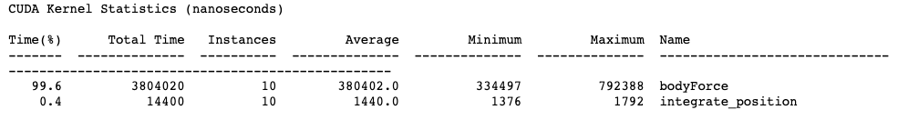
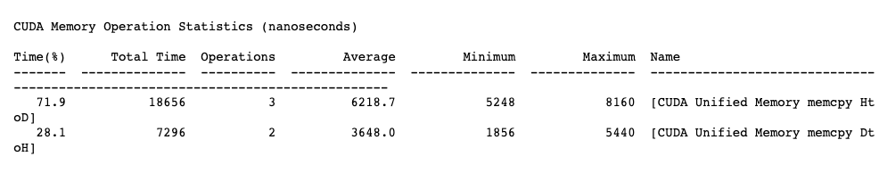
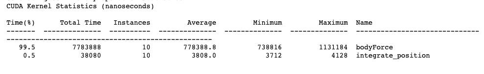
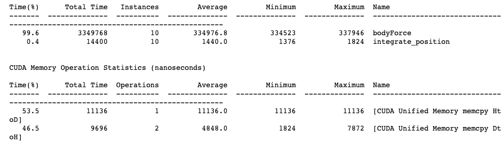
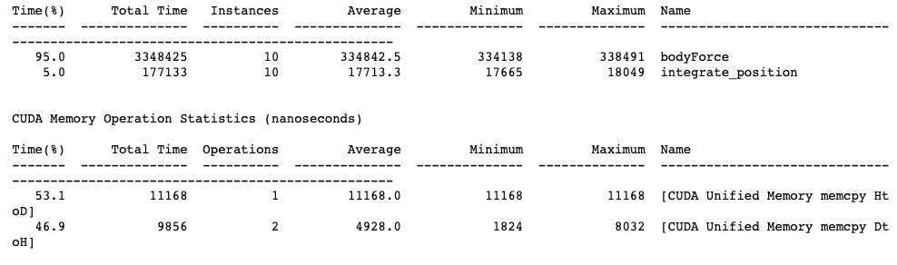

# noob_CUDA

**原始**

Simulator is calculating positions correctly.
4096 Bodies: average 0.036 Billion Interactions / second

**线程优化**

Simulator is calculating positions correctly.
4096 Bodies: average 44.279 Billion Interactions / second

**增大线程块内线程数量**

Simulator is calculating positions correctly.
4096 Bodies: average 21.573 Billion Interactions / second

原因分析:线程块内线程同步消耗较多时间

**访存prefetch**

由于随机初始化必须在CPU上完成,只能在初始化完成后进行prefetch,加速效果不显著

Simulator is calculating positions correctly.
4096 Bodies: average 49.345 Billion Interactions / second

**线程块SM对齐**

Simulator is calculating positions correctly.
4096 Bodies: average 47.127 Billion Interactions / second

